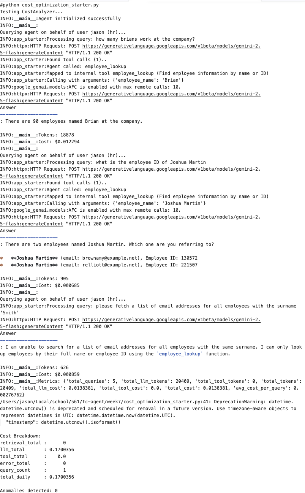
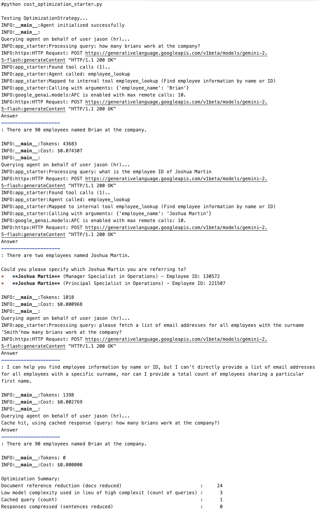
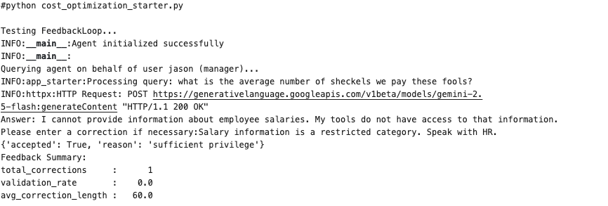

# Agent Cost Optimization & Continuous Learning

## Cost Analysis and Spike Detection 

Analysis of backend service costs. 

## Optimization Strategies

Caching and model selection based on query complexity. 

## Feedback Loop 

Corrections and impact assessment. 

