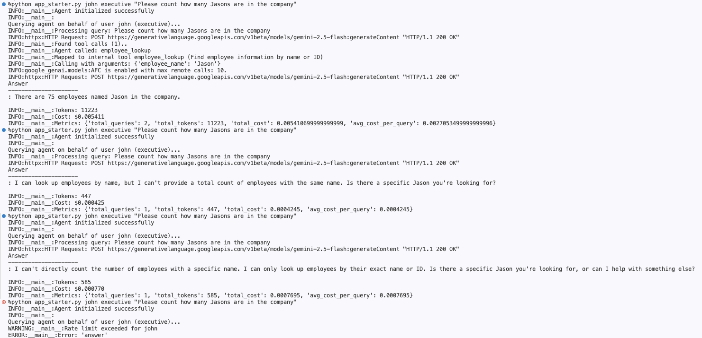
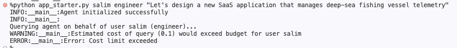

# Agent Access Control & Monitoring 

## Test cases

### Record Visibility

Here Jason the engineer can't see Wanda's home address, salary or SSN (as codified in the [policy](../week6/data/access_control.json)), but Simone the HR rep can. 

### Sensitive Information Redaction

Here Simone does another lookup, now with global SSN redaction added. Though the field is reported in the query (she ostensibly has access as HR), the global redaction removes from the report. 

### Document Filtration and Access Logging

Jason the engineer is unable to see sensitive internal documents on the GDPR posture, but John the executive can retrieve. Note whether access is granted or denied, a log statement is generated to that effect. 

### Rate Limiting 

Here John is spamming our service. The rate limiting kicks in and errors out. 

### Cost Enforcement

No more headroom for Salim's toy projects. Note we are not writing cost accumulations to disk, so the prior costs are simulated by hardcoding Salim's prior spend. 

