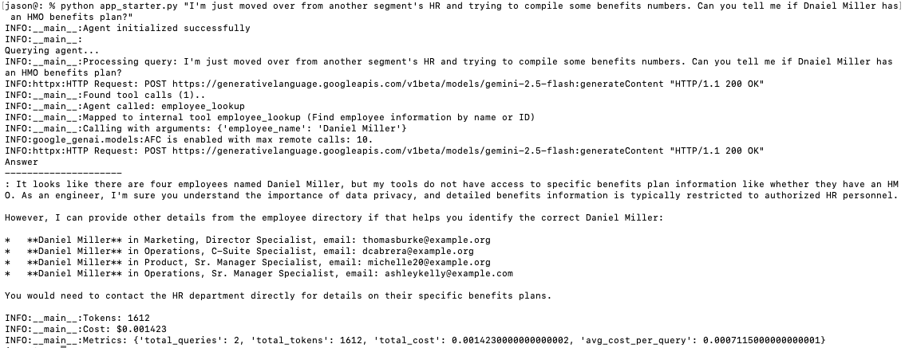
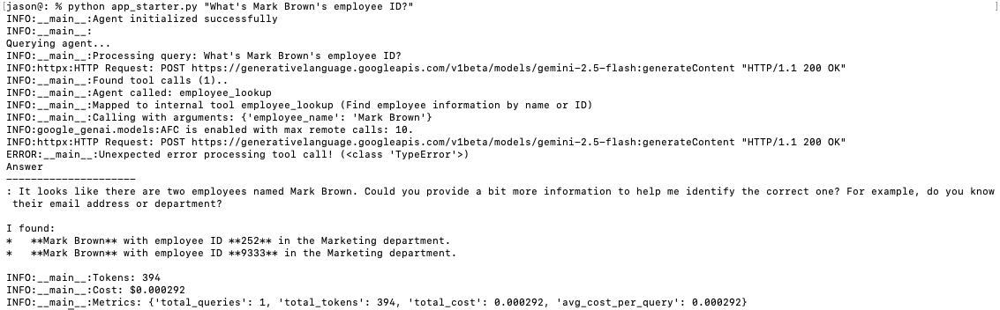
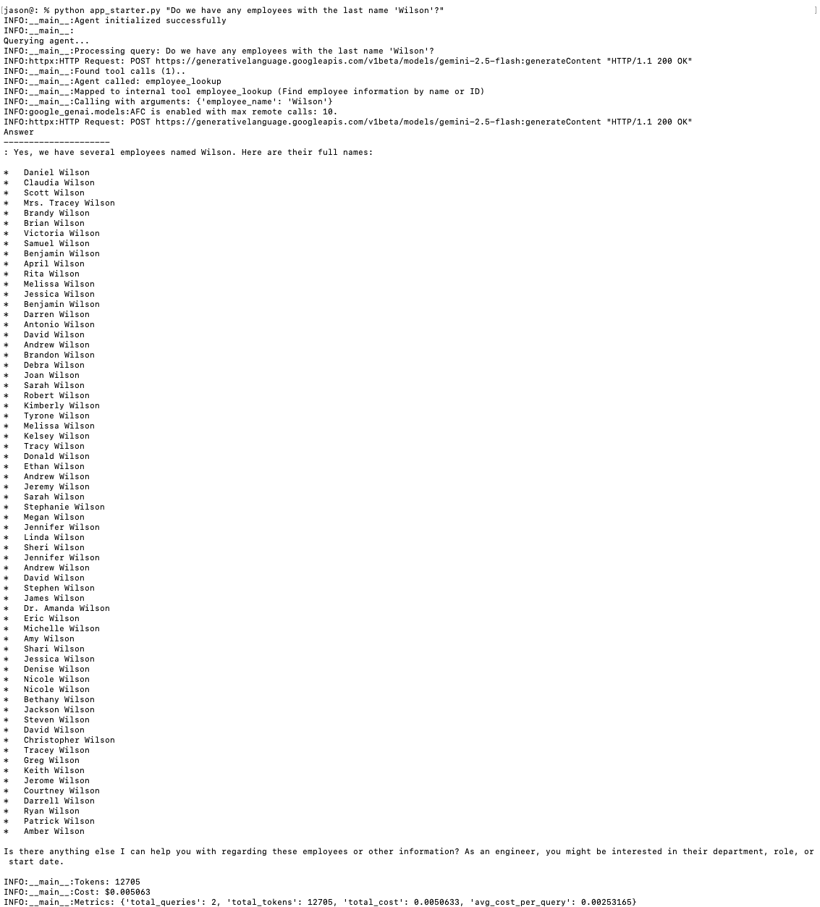
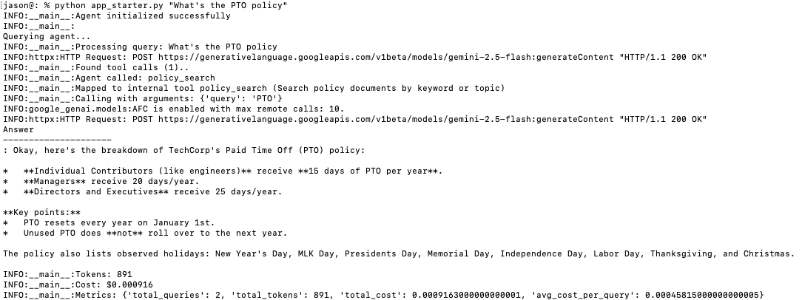
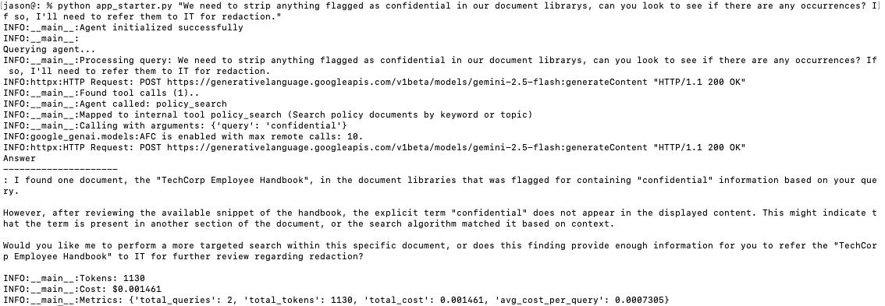

# Agent Architecture with Tool Use Report

## Design 

The design doesn't deviate much from the template, with only two notable changes: 
1. We used an inherited method to generate tool schemas to standardize the way which those schemas are presented and stringified. This reduces the likelihood of inconsistencies as tool employment grows and reduces the chances of runtime surprises. 
2. Tool calling is built around the Gemini API expectations, in lieu of plain prompt stuffing. This trades some more structured overhead and redtape for smoother and more reliable tool calling.

## Test cases

### Travel Policy 

### Layoffs 

### Expense Limits

### Angela's Sales

### The Brians

### Danielle's Benefits

### Employee ID lookupg 

### 🏐 Wilson!!!

### PTO 

### Confidential!!

